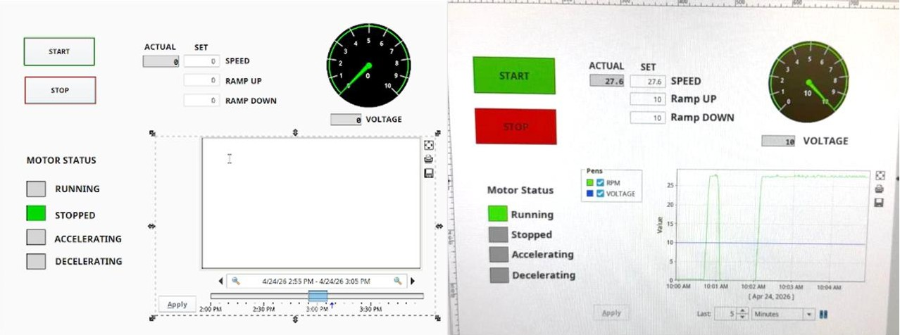
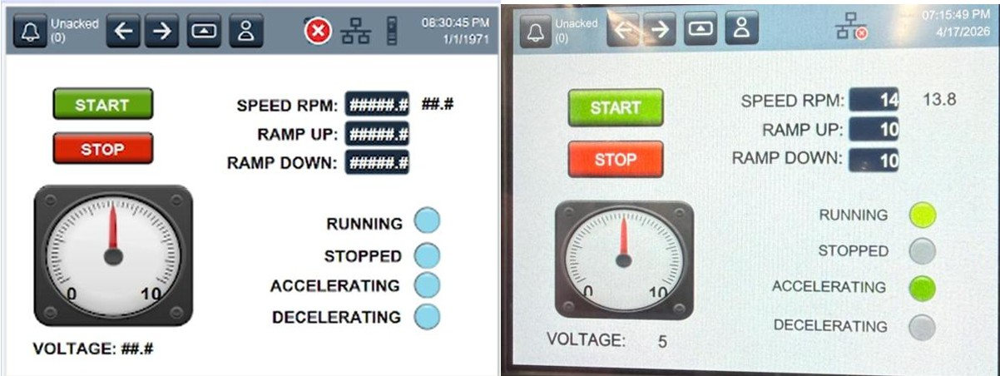

# ⚙️ DC Motor Speed Control — PLC, HMI & SCADA
### Industrial Automation System using Allen Bradley ControlLogix


---

## 📌 Overview

A complete industrial **DC motor speed control system** designed, wired, programmed, and tested from scratch. The system allows an operator to set motor speed, ramp-up time, and ramp-down time through both an **HMI touchscreen** and a **SCADA interface** — with real-time encoder feedback confirming actual RPM.

Built for the *Programmable Logic Controllers (MENG 3500)* course at Humber Polytechnic — Winter 2026.

> 👩‍💻 **Author:** Tanvi Bhanderi — Mechatronics Engineering

---

## 🖥️ System Demo

| SCADA Interface | HMI PanelView Terminal |
|---|---|
|  |  |

> Set Speed: **14 RPM** · Actual Speed: **13.8 RPM** · Voltage: **5V** · Error: **< 2%**

---

## ✨ Key Results

| Parameter | Value |
|---|---|
| Set Speed | 14 RPM |
| Actual Speed | 13.8 RPM |
| Speed Error | < 2% |
| Analog Output Range | 0 – 10 V |
| PLC Engineering Units | 0 – 4000 |
| Encoder Resolution | 200 pulses/revolution |
| Max Tested Speed | 27.6 RPM |

---

## 🏗️ System Architecture

```
Operator Input (HMI / SCADA)
           │
           ▼
   Allen Bradley ControlLogix PLC
           │
   ┌───────┼───────────────────┐
   │       │                   │
   ▼       ▼                   ▼
Analog   Digital            Encoder
Output   Outputs            Counter
(0–10V)  (Status Lamps)     (RPM Feedback)
   │                           │
   ▼                           │
DC Drive Board                 │
   │                           │
   ▼                           │
24V DC Motor ──────────────────┘
(with Incremental Encoder)
```

---

## 🔧 Technical Deep Dive

### 1. Hardware Components

| Component | Details |
|---|---|
| PLC | Allen Bradley ControlLogix |
| Motor | 24V DC with Incremental Encoder |
| Drive | DC Drive Board (0–10V analog input) |
| HMI | PanelView Terminal |
| Encoder | 200 pulses/revolution |
| I/O Modules | Digital Input, Digital Output, Analog Output |

---

### 2. Analog Output Scaling

The PLC converts RPM setpoints into engineering units (0–4000), then scales to a 0–10V analog signal sent to the DC drive:

```
Voltage = (Speed Units / 4000) × 10

Setpoint Conversion:
AT_SETPOINT_SPEED = (AT_SET_RPM × 4000) / 27.6
```

| PLC Units | Output Voltage |
|---|---|
| 0 | 0 V |
| 1000 | 2.5 V |
| 2000 | 5.0 V |
| 3000 | 7.5 V |
| 4000 | 10.0 V |

---

### 3. Encoder RPM Calculation

The encoder generates pulses as the motor rotates. The PLC counts pulses every 1 second and converts to RPM:

```
RPM = (Pulse Count / 200) × 60
```

Where 200 = pulses per revolution.

---

### 4. Ramp Up / Ramp Down Logic

Smooth ramping prevents sudden mechanical stress on start and stop:

```
Ramp Up Step   = 400 / AT_ACC_TIME
Ramp Down Step = 400 / AT_DEC_TIME
```

The speed reference increments/decrements by the ramp step every 100ms timer tick until it reaches the target.

---

### 5. Ladder Logic Structure (Studio 5000)

| Rung | Function |
|---|---|
| 0 | Start/Stop seal-in circuit |
| 1–2 | RPM → analog units conversion |
| 5–7 | Ramp up/down step calculation |
| 8–9 | Speed reference ramping logic |
| 10–11 | Speed limits (clamp 0–4000) |
| 12–14 | Encoder counting & RPM calculation |
| 15–16 | Analog output voltage command |
| 17–19 | Motor status lights (Running, Stopped, Accelerating, Decelerating) |

---

### 6. Motor Status Logic

| Status | Condition |
|---|---|
| 🟢 Running | AT_RUN = 1 AND speed > 0 |
| 🔴 Stopped | AT_RUN = 0 AND speed = 0 |
| 🟡 Accelerating | Speed ref < Setpoint AND speed > 0 |
| 🟠 Decelerating | Speed ref > Target (ramping down) |

---

## 📁 Repository Structure

```
📦 dc-motor-plc-control/
├── 📁 ladder-logic/
│   └── ladder_rungs.pdf           # Full ladder diagram export from Studio 5000
├── 📁 assets/
│   ├── scada_screenshot.jpg       # SCADA interface with live trend graph
│   └── hmi_screenshot.jpg         # HMI PanelView running/accelerating
├── 📄 Project_Report.pdf          # Full project report
└── 📄 README.md
```

> **Note:** The `.ACD` Studio 5000 project file is available on request. It cannot be uploaded directly to GitHub due to proprietary format restrictions.

---

## 🖥️ Software Used

- **Studio 5000 Logix Designer** — PLC ladder logic programming
- **FactoryTalk View ME** — HMI design and deployment
- **FactoryTalk View SE** — SCADA supervisory monitoring and trend logging

---

## 📊 Real-Time Graph Analysis

The SCADA trend graph plots:
- 🟢 **Green line** — Actual Motor RPM
- 🔵 **Blue line** — Analog Output Voltage

Multiple start-stop cycles confirmed **stable, repeatable operation**. Minor overshoot observed during fast acceleration due to motor inertia — identified and documented as an area for future PID improvement.

---

## 🧠 What I Learned

- Programming **Allen Bradley ControlLogix** PLCs using ladder logic in Studio 5000
- Designing and wiring a full **industrial control panel** — digital I/O, analog output, encoder input
- Building operator interfaces in **FactoryTalk View ME (HMI)** and **View SE (SCADA)**
- Implementing **analog scaling formulas** to convert RPM setpoints to drive voltage
- Using **incremental encoders** for closed-loop speed measurement
- Analyzing **real-time trend data** and diagnosing overshoot/undershoot behavior

---

## 🔮 Future Improvements

- Implement **PID closed-loop control** for tighter speed regulation
- Add **reverse direction control**
- Add **overload protection** logic
- Apply **RPM signal filtering** to reduce encoder noise

---

## 📚 References

- Allen Bradley ControlLogix Documentation
- FactoryTalk View ME/SE User Manual
- Humber Polytechnic MENG 3500 — Programmable Logic Controllers, Winter 2026

---

<p align="center">
  Built by Tanvi Bhanderi · Humber Polytechnic — Mechatronics Engineering
</p>
